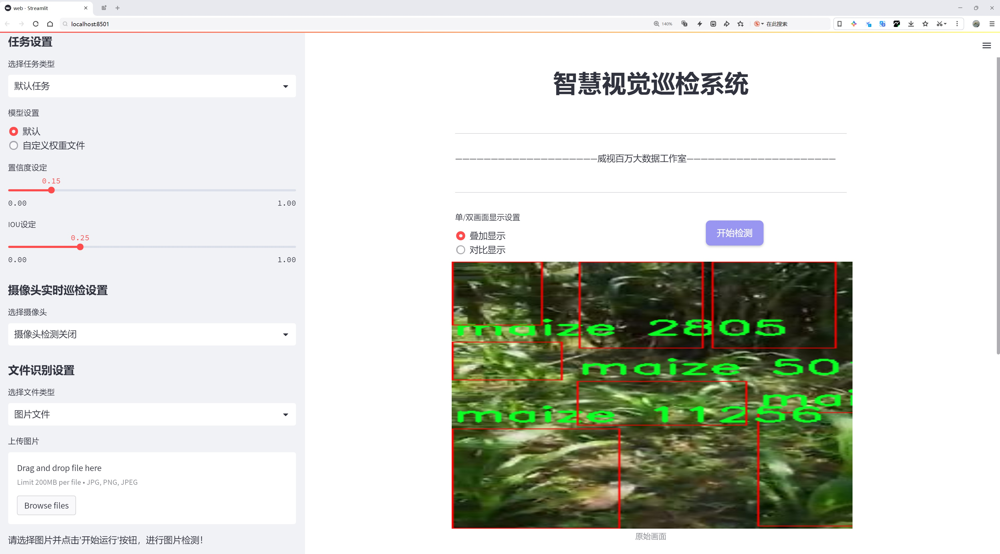
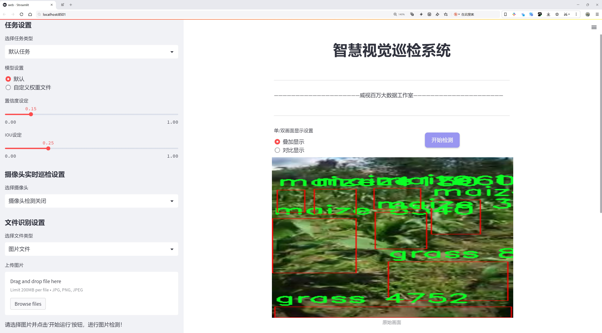
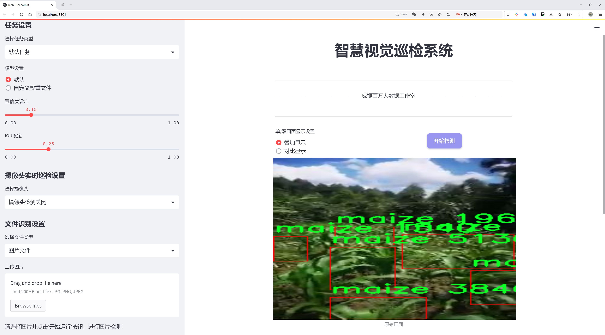
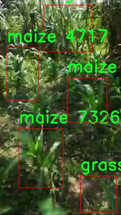
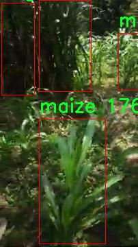
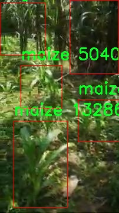
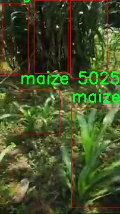
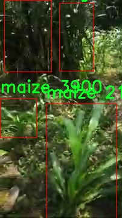

# 作物类型检测系统源码分享
 # [一条龙教学YOLOV8标注好的数据集一键训练_70+全套改进创新点发刊_Web前端展示]

### 1.研究背景与意义

项目参考[AAAI Association for the Advancement of Artificial Intelligence](https://gitee.com/qunmasj/projects)

项目来源[AACV Association for the Advancement of Computer Vision](https://kdocs.cn/l/cszuIiCKVNis)

研究背景与意义

随着全球人口的不断增长，农业生产面临着前所未有的挑战。作物种类的多样性以及气候变化对农业生产的影响，使得高效的作物管理和监测成为了现代农业发展的重要课题。在此背景下，计算机视觉技术，尤其是基于深度学习的目标检测方法，逐渐成为农业智能化的重要工具。YOLO（You Only Look Once）系列模型因其快速和高效的特性，已广泛应用于各种目标检测任务中。YOLOv8作为该系列的最新版本，具备更强的特征提取能力和更高的检测精度，为作物类型的自动识别提供了新的可能性。

本研究旨在基于改进的YOLOv8模型，构建一个高效的作物类型检测系统，主要针对玉米、木薯、甘蔗等主要作物的自动识别与分类。通过对570张包含香蕉、咖啡、草、玉米和甘蔗等五类作物的图像进行训练和测试，我们希望能够实现对不同作物类型的精准检测。这一系统的构建不仅能够提高作物监测的效率，还能够为农业决策提供科学依据，助力精准农业的发展。

作物类型的准确识别在农业生产中具有重要的实际意义。首先，它可以帮助农民及时了解田间作物的生长状况，进而优化施肥、灌溉和病虫害防治等管理措施，提高作物产量和质量。其次，在农业资源管理中，准确的作物类型检测能够为土地利用规划、作物轮作及生态保护提供数据支持，促进可持续农业的发展。此外，随着农业机械化的推进，基于视觉的作物识别技术也将为自动化农机的智能化作业提供重要的技术支撑。

在技术层面，YOLOv8模型的改进将着重于提高对不同作物特征的敏感性，增强模型在复杂环境下的鲁棒性。通过引入数据增强、迁移学习等技术手段，我们期望能够提升模型的泛化能力，使其在实际应用中表现出色。针对数据集中的不同作物特征，研究将探索适合的特征提取方法和模型优化策略，以实现更高的检测精度和更快的推理速度。

综上所述，基于改进YOLOv8的作物类型检测系统的研究，不仅具有重要的理论价值，也具备广泛的应用前景。通过这一研究，我们希望能够为农业智能化提供新的思路和方法，推动农业生产的现代化进程，最终实现提高农业生产效率和可持续发展的目标。

### 2.图片演示







##### 注意：由于此博客编辑较早，上面“2.图片演示”和“3.视频演示”展示的系统图片或者视频可能为老版本，新版本在老版本的基础上升级如下：（实际效果以升级的新版本为准）

  （1）适配了YOLOV8的“目标检测”模型和“实例分割”模型，通过加载相应的权重（.pt）文件即可自适应加载模型。

  （2）支持“图片识别”、“视频识别”、“摄像头实时识别”三种识别模式。

  （3）支持“图片识别”、“视频识别”、“摄像头实时识别”三种识别结果保存导出，解决手动导出（容易卡顿出现爆内存）存在的问题，识别完自动保存结果并导出到tempDir中。

  （4）支持Web前端系统中的标题、背景图等自定义修改，后面提供修改教程。

  另外本项目提供训练的数据集和训练教程,暂不提供权重文件（best.pt）,需要您按照教程进行训练后实现图片演示和Web前端界面演示的效果。

### 3.视频演示

[3.1 视频演示](https://www.bilibili.com/video/BV1Wy2uYoECD/)

### 4.数据集信息展示

##### 4.1 本项目数据集详细数据（类别数＆类别名）

nc: 5
names: ['banana', 'coffee', 'grass', 'maize', 'sugarcane']


##### 4.2 本项目数据集信息介绍

数据集信息展示

在现代农业科技的快速发展中，作物类型的准确检测成为提升农业生产效率和资源管理的重要环节。本研究所采用的数据集名为“Crops (Maize, Cassava, Sugarcane Vs Grass)”，旨在为改进YOLOv8的作物类型检测系统提供高质量的训练数据。该数据集包含五个类别，分别是香蕉、咖啡、草、玉米和甘蔗，涵盖了多样化的作物类型，以确保模型在实际应用中的广泛适应性和准确性。

数据集的构建过程经过精心设计，确保每个类别的样本数量均衡，且样本的拍摄环境多样化，以模拟真实农业场景中的变化。样本的获取涵盖了不同的生长阶段、光照条件和背景环境，使得模型在训练过程中能够学习到丰富的特征信息。这种多样性不仅提高了模型的鲁棒性，也增强了其在不同环境下的适应能力。

在数据集的标注过程中，采用了高精度的标注工具，确保每个样本的标注信息准确无误。每个图像均被标注为对应的作物类别，并附有相应的边界框，以便于YOLOv8模型在训练时能够有效地学习到各类作物的特征。通过这种精细化的标注方式，模型将能够在实际应用中实现高效的作物识别与分类。

此外，为了进一步提升模型的性能，数据集还包含了一些增强技术生成的样本。这些样本通过旋转、缩放、裁剪等方式生成，增加了数据集的多样性，帮助模型更好地应对不同的作物外观变化和环境干扰。这种数据增强策略在训练深度学习模型时被广泛应用，能够有效防止模型的过拟合现象，提高其在未见样本上的泛化能力。

数据集的选择和构建对于深度学习模型的训练效果至关重要。通过使用“Crops (Maize, Cassava, Sugarcane Vs Grass)”数据集，研究者能够在不同作物类型的检测任务中实现更高的准确率和效率。该数据集不仅适用于YOLOv8模型的训练，也为其他计算机视觉任务提供了宝贵的参考。

总之，“Crops (Maize, Cassava, Sugarcane Vs Grass)”数据集的构建和应用为作物类型检测系统的改进提供了坚实的基础。通过精心设计的样本选择和标注策略，研究者能够有效地训练出高性能的检测模型，推动农业智能化的发展。这一数据集的成功应用，将为未来的农业监测、管理和决策提供重要的数据支持，助力实现更高效的农业生产和可持续发展。











### 5.全套项目环境部署视频教程（零基础手把手教学）

[5.1 环境部署教程链接（零基础手把手教学）](https://www.ixigua.com/7404473917358506534?logTag=c807d0cbc21c0ef59de5)


[5.2 安装Python虚拟环境创建和依赖库安装视频教程链接（零基础手把手教学）](https://www.ixigua.com/7404474678003106304?logTag=1f1041108cd1f708b01a)

### 6.手把手YOLOV8训练视频教程（零基础小白有手就能学会）

[6.1 手把手YOLOV8训练视频教程（零基础小白有手就能学会）](https://www.ixigua.com/7404477157818401292?logTag=d31a2dfd1983c9668658)


按照上面的训练视频教程链接加载项目提供的数据集，运行train.py即可开始训练



     Epoch   gpu_mem       box       obj       cls    labels  img_size
     1/200     20.8G   0.01576   0.01955  0.007536        22      1280: 100%|██████████| 849/849 [14:42<00:00,  1.04s/it]
               Class     Images     Labels          P          R     mAP@.5 mAP@.5:.95: 100%|██████████| 213/213 [01:14<00:00,  2.87it/s]
                 all       3395      17314      0.994      0.957      0.0957      0.0843

     Epoch   gpu_mem       box       obj       cls    labels  img_size
     2/200     20.8G   0.01578   0.01923  0.007006        22      1280: 100%|██████████| 849/849 [14:44<00:00,  1.04s/it]
               Class     Images     Labels          P          R     mAP@.5 mAP@.5:.95: 100%|██████████| 213/213 [01:12<00:00,  2.95it/s]
                 all       3395      17314      0.996      0.956      0.0957      0.0845

     Epoch   gpu_mem       box       obj       cls    labels  img_size
     3/200     20.8G   0.01561    0.0191  0.006895        27      1280: 100%|██████████| 849/849 [10:56<00:00,  1.29it/s]
               Class     Images     Labels          P          R     mAP@.5 mAP@.5:.95: 100%|███████   | 187/213 [00:52<00:00,  4.04it/s]
                 all       3395      17314      0.996      0.957      0.0957      0.0845


### 7.70+种全套YOLOV8创新点代码加载调参视频教程（一键加载写好的改进模型的配置文件）

[7.1 70+种全套YOLOV8创新点代码加载调参视频教程（一键加载写好的改进模型的配置文件）](https://www.ixigua.com/7404478314661806627?logTag=29066f8288e3f4eea3a4)

### 8.70+种全套YOLOV8创新点原理讲解（非科班也可以轻松写刊发刊，V10版本正在科研待更新）

#### 由于篇幅限制，每个创新点的具体原理讲解就不一一展开，具体见下列网址中的创新点对应子项目的技术原理博客网址【Blog】：


[8.1 70+种全套YOLOV8创新点原理讲解链接](https://gitee.com/qunmasj/good)

#### 部分改进原理讲解(完整的改进原理见上图和技术博客链接)【如果此小节的图加载失败可以通过CSDN或者Github搜索该博客的标题访问原始博客，原始博客图片显示正常】

### YOLOv8简介
#### Backbone
Darknet-53
53指的是“52层卷积”+output layer。

借鉴了其他算法的这些设计思想

借鉴了VGG的思想，使用了较多的3×3卷积，在每一次池化操作后，将通道数翻倍；

借鉴了network in network的思想，使用全局平均池化（global average pooling）做预测，并把1×1的卷积核置于3×3的卷积核之间，用来压缩特征；（我没找到这一步体现在哪里）


使用了批归一化层稳定模型训练，加速收敛，并且起到正则化作用。

    以上三点为Darknet19借鉴其他模型的点。Darknet53当然是在继承了Darknet19的这些优点的基础上再新增了下面这些优点的。因此列在了这里

借鉴了ResNet的思想，在网络中大量使用了残差连接，因此网络结构可以设计的很深，并且缓解了训练中梯度消失的问题，使得模型更容易收敛。

使用步长为2的卷积层代替池化层实现降采样。（这一点在经典的Darknet-53上是很明显的，output的长和宽从256降到128，再降低到64，一路降低到8，应该是通过步长为2的卷积层实现的；在YOLOv8的卷积层中也有体现，比如图中我标出的这些位置）

#### 特征融合

模型架构图如下

  Darknet-53的特点可以这样概括：（Conv卷积模块+Residual Block残差块）串行叠加4次

  Conv卷积层+Residual Block残差网络就被称为一个stage


上面红色指出的那个，原始的Darknet-53里面有一层 卷积，在YOLOv8里面，把一层卷积移除了

为什么移除呢？

        原始Darknet-53模型中间加的这个卷积层做了什么？滤波器（卷积核）的个数从 上一个卷积层的512个，先增加到1024个卷积核，然后下一层卷积的卷积核的个数又降低到512个

        移除掉这一层以后，少了1024个卷积核，就可以少做1024次卷积运算，同时也少了1024个3×3的卷积核的参数，也就是少了9×1024个参数需要拟合。这样可以大大减少了模型的参数，（相当于做了轻量化吧）

        移除掉这个卷积层，可能是因为作者发现移除掉这个卷积层以后，模型的score有所提升，所以才移除掉的。为什么移除掉以后，分数有所提高呢？可能是因为多了这些参数就容易，参数过多导致模型在训练集删过拟合，但是在测试集上表现很差，最终模型的分数比较低。你移除掉这个卷积层以后，参数减少了，过拟合现象不那么严重了，泛化能力增强了。当然这个是，拿着你做实验的结论，反过来再找补，再去强行解释这种现象的合理性。


通过MMdetection官方绘制册这个图我们可以看到，进来的这张图片经过一个“Feature Pyramid Network(简称FPN)”，然后最后的P3、P4、P5传递给下一层的Neck和Head去做识别任务。 PAN（Path Aggregation Network）


“FPN是自顶向下，将高层的强语义特征传递下来。PAN就是在FPN的后面添加一个自底向上的金字塔，对FPN补充，将低层的强定位特征传递上去，

FPN是自顶（小尺寸，卷积次数多得到的结果，语义信息丰富）向下（大尺寸，卷积次数少得到的结果），将高层的强语义特征传递下来，对整个金字塔进行增强，不过只增强了语义信息，对定位信息没有传递。PAN就是针对这一点，在FPN的后面添加一个自底（卷积次数少，大尺寸）向上（卷积次数多，小尺寸，语义信息丰富）的金字塔，对FPN补充，将低层的强定位特征传递上去，又被称之为“双塔战术”。

FPN层自顶向下传达强语义特征，而特征金字塔则自底向上传达强定位特征，两两联手，从不同的主干层对不同的检测层进行参数聚合,这样的操作确实很皮。
#### 自底向上增强


而 PAN（Path Aggregation Network）是对 FPN 的一种改进，它的设计理念是在 FPN 后面添加一个自底向上的金字塔。PAN 引入了路径聚合的方式，通过将浅层特征图（低分辨率但语义信息较弱）和深层特征图（高分辨率但语义信息丰富）进行聚合，并沿着特定的路径传递特征信息，将低层的强定位特征传递上去。这样的操作能够进一步增强多尺度特征的表达能力，使得 PAN 在目标检测任务中表现更加优秀。


### Gold-YOLO简介
YOLO系列模型面世至今已有8年，由于其优异的性能，已成为目标检测领域的标杆。在系列模型经过十多个不同版本的改进发展逐渐稳定完善的今天，研究人员更多关注于单个计算模块内结构的精细调整，或是head部分和训练方法上的改进。但这并不意味着现有模式已是最优解。

当前YOLO系列模型通常采用类FPN方法进行信息融合，而这一结构在融合跨层信息时存在信息损失的问题。针对这一问题，我们提出了全新的信息聚集-分发（Gather-and-Distribute Mechanism）GD机制，通过在全局视野上对不同层级的特征进行统一的聚集融合并分发注入到不同层级中，构建更加充分高效的信息交互融合机制，并基于GD机制构建了Gold-YOLO。在COCO数据集中，我们的Gold-YOLO超越了现有的YOLO系列，实现了精度-速度曲线上的SOTA。


精度和速度曲线（TensorRT7）


精度和速度曲线（TensorRT8）
传统YOLO的问题
在检测模型中，通常先经过backbone提取得到一系列不同层级的特征，FPN利用了backbone的这一特点，构建了相应的融合结构：不层级的特征包含着不同大小物体的位置信息，虽然这些特征包含的信息不同，但这些特征在相互融合后能够互相弥补彼此缺失的信息，增强每一层级信息的丰富程度，提升网络性能。

原始的FPN结构由于其层层递进的信息融合模式，使得相邻层的信息能够充分融合，但也导致了跨层信息融合存在问题：当跨层的信息进行交互融合时，由于没有直连的交互通路，只能依靠中间层充当“中介”进行融合，导致了一定的信息损失。之前的许多工作中都关注到了这一问题，而解决方案通常是通过添加shortcut增加更多的路径，以增强信息流动。

然而传统的FPN结构即便改进后，由于网络中路径过多，且交互方式不直接，基于FPN思想的信息融合结构仍然存在跨层信息交互困难和信息损失的问题。

#### Gold-YOLO：全新的信息融合交互机制


#### Gold-YOLO架构
参考该博客提出的一种全新的信息交互融合机制：信息聚集-分发机制(Gather-and-Distribute Mechanism)。该机制通过在全局上融合不同层次的特征得到全局信息，并将全局信息注入到不同层级的特征中，实现了高效的信息交互和融合。在不显著增加延迟的情况下GD机制显著增强了Neck部分的信息融合能力，提高了模型对不同大小物体的检测能力。

GD机制通过三个模块实现：信息对齐模块(FAM)、信息融合模块(IFM)和信息注入模块(Inject)。

信息对齐模块负责收集并对齐不同层级不同大小的特征

信息融合模块通过使用卷积或Transformer算子对对齐后的的特征进行融合，得到全局信息

信息注入模块将全局信息注入到不同层级中

在Gold-YOLO中，针对模型需要检测不同大小的物体的需要，并权衡精度和速度，我们构建了两个GD分支对信息进行融合：低层级信息聚集-分发分支(Low-GD)和高层级信息聚集-分发分支(High-GD)，分别基于卷积和transformer提取和融合特征信息。

此外,为了促进局部信息的流动，我们借鉴现有工作，构建了一个轻量级的邻接层融合模块，该模块在局部尺度上结合了邻近层的特征，进一步提升了模型性能。我们还引入并验证了预训练方法对YOLO模型的有效性，通过在ImageNet 1K上使用MAE方法对主干进行预训练，显著提高了模型的收敛速度和精度。


### 9.系统功能展示（检测对象为举例，实际内容以本项目数据集为准）

图9.1.系统支持检测结果表格显示

  图9.2.系统支持置信度和IOU阈值手动调节

  图9.3.系统支持自定义加载权重文件best.pt(需要你通过步骤5中训练获得)

  图9.4.系统支持摄像头实时识别

  图9.5.系统支持图片识别

  图9.6.系统支持视频识别

  图9.7.系统支持识别结果文件自动保存

  图9.8.系统支持Excel导出检测结果数据


### 10.原始YOLOV8算法原理

原始YOLOv8算法原理

YOLOv8算法是由Glenn-Jocher提出的最新目标检测模型，承载着YOLO系列算法的优良传统，尤其是YOLOv3和YOLOv5的核心思想与架构。作为YOLO系列的最新迭代，YOLOv8在多个方面进行了创新和改进，旨在提升目标检测的精度和速度，满足现代计算机视觉应用的需求。

首先，YOLOv8在数据预处理方面延续了YOLOv5的策略，采用了一系列增强手段来提高模型的鲁棒性和泛化能力。这些增强手段包括马赛克增强、混合增强、空间扰动和颜色扰动等。马赛克增强通过将多张图像拼接在一起，增加了样本的多样性；混合增强则通过对不同图像进行混合，进一步丰富了训练数据；空间扰动和颜色扰动则帮助模型适应不同的场景和光照条件。这些预处理手段的结合，使得YOLOv8在面对复杂环境时，能够更好地识别和定位目标。

在骨干网络结构方面，YOLOv8在YOLOv5的基础上进行了优化，采用了新的C2f模块替代了原有的C3模块。C2f模块通过引入更多的分支，增强了梯度回传时的支流，使得特征提取更加高效。C2f模块的设计理念是通过跨层连接，增强模型的梯度流动，从而改善特征的表达能力。YOLOv8的骨干网络在设计上保持了清晰的层次结构，通过步长为2的3×3卷积进行特征图的降采样，结合C2f模块的多分支特性，使得网络在提取特征时更加灵活。

YOLOv8继续采用FPN（特征金字塔网络）和PAN（路径聚合网络）结构，以实现多尺度信息的充分融合。FPN-PAN结构的设计使得不同尺度的特征图能够有效地结合，从而提升模型对不同大小目标的检测能力。YOLOv8在这一结构中将C3模块替换为C2f模块，进一步增强了特征融合的效果，使得模型在处理复杂场景时，能够更好地捕捉到目标的多样性。

在检测头的设计上，YOLOv8引入了解耦头的结构，这一设计理念源于YOLOX的创新。解耦头通过两条并行的分支分别提取类别特征和位置特征，利用1×1卷积完成分类和定位任务。这种结构的优势在于能够更清晰地分离分类和定位的任务，从而提高模型的整体性能。解耦头的设计使得YOLOv8在处理复杂场景时，能够更好地平衡分类和定位的精度，提升了目标检测的准确性。

在标签分配策略方面，YOLOv8采用了TOOD（Task-Oriented Object Detection）策略，这是一种动态标签分配方法。与YOLOv5的候选框聚类策略不同，TOOD策略不依赖于数据集的分布特征，而是通过动态调整正负样本的匹配，优化多尺度分配。YOLOv8的损失函数主要由类别损失和位置损失组成，其中类别损失采用了VFL（Varifocal Loss），位置损失则结合了CIoU（Complete Intersection over Union）和DFL（Discriminative Focal Loss）。VFL的设计通过不对称参数对正负样本进行加权，强调高质量正样本的贡献，降低负样本对损失的影响，从而提升模型的训练效果。

综上所述，YOLOv8算法在数据预处理、骨干网络、特征融合、检测头设计以及标签分配策略等多个方面进行了全面的优化与创新。这些改进不仅提升了模型的检测精度和速度，还增强了其在复杂场景下的适应能力。YOLOv8的推出，标志着目标检测技术的又一次飞跃，为智能监控、自动驾驶、人脸识别等应用领域提供了更为强大的技术支持。随着YOLOv8的广泛应用，未来的目标检测研究将更加注重模型的高效性与准确性，推动计算机视觉技术的不断进步。


### 11.项目核心源码讲解（再也不用担心看不懂代码逻辑）

#### 11.1 code\ultralytics\models\sam\modules\decoders.py

以下是经过精简和注释的核心代码，保留了主要功能和结构，同时对每个部分进行了详细的中文注释：

```python
import torch
from torch import nn
from torch.nn import functional as F
from ultralytics.nn.modules import LayerNorm2d

class MaskDecoder(nn.Module):
    """
    MaskDecoder类用于生成图像的掩码和质量评分，采用变换器架构。
    """

    def __init__(self, transformer_dim: int, transformer: nn.Module, num_multimask_outputs: int = 3) -> None:
        """
        初始化MaskDecoder。

        Args:
            transformer_dim (int): 变换器模块的通道维度。
            transformer (nn.Module): 用于预测掩码的变换器。
            num_multimask_outputs (int): 预测的掩码数量。
        """
        super().__init__()
        self.transformer_dim = transformer_dim
        self.transformer = transformer
        self.num_multimask_outputs = num_multimask_outputs

        # IoU标记的嵌入
        self.iou_token = nn.Embedding(1, transformer_dim)
        # 掩码标记的嵌入
        self.mask_tokens = nn.Embedding(num_multimask_outputs + 1, transformer_dim)

        # 输出上采样网络
        self.output_upscaling = nn.Sequential(
            nn.ConvTranspose2d(transformer_dim, transformer_dim // 4, kernel_size=2, stride=2),
            LayerNorm2d(transformer_dim // 4),
            nn.GELU(),
            nn.ConvTranspose2d(transformer_dim // 4, transformer_dim // 8, kernel_size=2, stride=2),
            nn.GELU(),
        )

        # 生成掩码的超网络MLP
        self.output_hypernetworks_mlps = nn.ModuleList(
            [MLP(transformer_dim, transformer_dim, transformer_dim // 8, 3) for _ in range(num_multimask_outputs + 1)]
        )

        # 预测掩码质量的MLP
        self.iou_prediction_head = MLP(transformer_dim, 256, num_multimask_outputs + 1, 3)

    def forward(self, image_embeddings: torch.Tensor, sparse_prompt_embeddings: torch.Tensor, multimask_output: bool) -> Tuple[torch.Tensor, torch.Tensor]:
        """
        根据图像和提示嵌入预测掩码。

        Args:
            image_embeddings (torch.Tensor): 图像编码器的嵌入。
            sparse_prompt_embeddings (torch.Tensor): 稀疏提示的嵌入。
            multimask_output (bool): 是否返回多个掩码。

        Returns:
            torch.Tensor: 预测的掩码。
            torch.Tensor: 掩码质量的预测。
        """
        masks, iou_pred = self.predict_masks(image_embeddings, sparse_prompt_embeddings)

        # 根据需要选择掩码
        mask_slice = slice(1, None) if multimask_output else slice(0, 1)
        masks = masks[:, mask_slice, :, :]
        iou_pred = iou_pred[:, mask_slice]

        return masks, iou_pred

    def predict_masks(self, image_embeddings: torch.Tensor, sparse_prompt_embeddings: torch.Tensor) -> Tuple[torch.Tensor, torch.Tensor]:
        """
        预测掩码。

        Args:
            image_embeddings (torch.Tensor): 图像嵌入。
            sparse_prompt_embeddings (torch.Tensor): 稀疏提示嵌入。

        Returns:
            Tuple[torch.Tensor, torch.Tensor]: 预测的掩码和IoU预测。
        """
        # 连接输出标记
        output_tokens = torch.cat([self.iou_token.weight, self.mask_tokens.weight], dim=0)
        output_tokens = output_tokens.unsqueeze(0).expand(sparse_prompt_embeddings.size(0), -1, -1)
        tokens = torch.cat((output_tokens, sparse_prompt_embeddings), dim=1)

        # 扩展每个图像的数据
        src = image_embeddings.repeat(tokens.shape[0], 1, 1, 1) + sparse_prompt_embeddings
        pos_src = image_embeddings.repeat(tokens.shape[0], 1, 1, 1)

        # 运行变换器
        hs, src = self.transformer(src, pos_src, tokens)
        iou_token_out = hs[:, 0, :]
        mask_tokens_out = hs[:, 1 : (1 + self.num_multimask_outputs), :]

        # 上采样掩码嵌入并预测掩码
        src = src.transpose(1, 2).view(src.size(0), src.size(1), -1)
        upscaled_embedding = self.output_upscaling(src)
        hyper_in_list = [self.output_hypernetworks_mlps[i](mask_tokens_out[:, i, :]) for i in range(self.num_multimask_outputs + 1)]
        hyper_in = torch.stack(hyper_in_list, dim=1)
        masks = (hyper_in @ upscaled_embedding.view(upscaled_embedding.size(0), -1)).view(upscaled_embedding.size(0), -1, upscaled_embedding.size(2), upscaled_embedding.size(3))

        # 生成IoU预测
        iou_pred = self.iou_prediction_head(iou_token_out)

        return masks, iou_pred


class MLP(nn.Module):
    """
    多层感知机（MLP）模型。
    """

    def __init__(self, input_dim: int, hidden_dim: int, output_dim: int, num_layers: int) -> None:
        """
        初始化MLP。

        Args:
            input_dim (int): 输入特征的维度。
            hidden_dim (int): 隐藏层的维度。
            output_dim (int): 输出层的维度。
            num_layers (int): 隐藏层的数量。
        """
        super().__init__()
        self.layers = nn.ModuleList(
            nn.Linear(n, k) for n, k in zip([input_dim] + [hidden_dim] * (num_layers - 1), [hidden_dim] * (num_layers - 1) + [output_dim])
        )

    def forward(self, x):
        """执行前向传播并应用激活函数。"""
        for i, layer in enumerate(self.layers):
            x = F.relu(layer(x)) if i < len(self.layers) - 1 else layer(x)
        return x
```

### 代码说明：
1. **MaskDecoder类**：主要用于生成图像的掩码和质量评分。通过变换器架构进行掩码预测。
   - `__init__`方法初始化了变换器、IoU标记、掩码标记、输出上采样网络和预测掩码质量的MLP。
   - `forward`方法根据输入的图像嵌入和提示嵌入预测掩码。
   - `predict_masks`方法具体实现了掩码的预测逻辑。

2. **MLP类**：实现了一个简单的多层感知机，用于处理特征的转换。
   - `__init__`方法定义了输入、隐藏和输出层的维度。
   - `forward`方法执行前向传播，应用ReLU激活函数。

以上代码为MaskDecoder的核心部分，保留了主要功能并进行了详细注释。

这个文件定义了一个名为 `MaskDecoder` 的类，主要用于生成图像的掩码及其质量评分，采用了变换器（transformer）架构来根据图像和提示嵌入进行掩码预测。该类的构造函数接受多个参数，包括变换器的维度、变换器模块、输出掩码的数量、激活函数类型、IoU（Intersection over Union）头的深度和隐藏维度等。

在初始化过程中，`MaskDecoder` 创建了一些重要的组件。首先，它定义了一个 IoU 嵌入层，用于表示 IoU 令牌，并创建了多个掩码令牌的嵌入层。接着，它构建了一个输出上采样的神经网络序列，通过转置卷积和层归一化等操作将输出的特征图进行上采样。此外，它还创建了一个超网络（hypernetwork）模块列表，用于生成掩码，以及一个用于预测掩码质量的多层感知机（MLP）。

`forward` 方法是该类的主要接口，接收图像嵌入、位置编码、稀疏和密集提示嵌入等输入，返回预测的掩码和相应的质量评分。在这个方法中，首先调用 `predict_masks` 方法来生成掩码和 IoU 预测。然后，根据是否需要多掩码输出，选择合适的掩码进行返回。

`predict_masks` 方法实现了掩码的具体预测过程。它首先将 IoU 令牌和掩码令牌的权重进行拼接，并与稀疏提示嵌入合并。接着，图像嵌入和位置编码被扩展以适应每个掩码的需求，并传入变换器进行处理。变换器的输出被用来生成掩码的嵌入，并通过上采样和超网络生成最终的掩码。最后，IoU 预测通过 MLP 进行计算。

此外，文件中还定义了一个 `MLP` 类，用于构建多层感知机模型。该类接受输入维度、隐藏层维度、输出维度和层数等参数，并在前向传播中执行线性变换和激活函数。该 MLP 可以选择在输出层应用 Sigmoid 激活函数。

整体来看，这个文件实现了一个复杂的掩码解码器，结合了深度学习中的变换器和多层感知机结构，旨在提高图像分割任务中的掩码生成和质量评估能力。

#### 11.2 code\ultralytics\models\yolo\pose\__init__.py

以下是代码中最核心的部分，并附上详细的中文注释：

```python
# 导入所需的模块
from .predict import PosePredictor  # 导入姿态预测器
from .train import PoseTrainer      # 导入姿态训练器
from .val import PoseValidator       # 导入姿态验证器

# 定义模块的公开接口
__all__ = "PoseTrainer", "PoseValidator", "PosePredictor"  # 指定可以被外部访问的类或函数
```

### 注释说明：
1. **导入模块**：
   - `from .predict import PosePredictor`：从当前包的 `predict` 模块中导入 `PosePredictor` 类，负责姿态预测的功能。
   - `from .train import PoseTrainer`：从当前包的 `train` 模块中导入 `PoseTrainer` 类，负责姿态模型的训练。
   - `from .val import PoseValidator`：从当前包的 `val` 模块中导入 `PoseValidator` 类，负责对训练好的模型进行验证。

2. **定义公开接口**：
   - `__all__` 是一个特殊变量，用于定义当使用 `from module import *` 时，哪些类或函数是可以被导入的。在这里，指定了 `PoseTrainer`、`PoseValidator` 和 `PosePredictor` 三个类为模块的公开接口。这样做可以控制模块的可见性，避免不必要的名称冲突。

这个程序文件是一个Python模块的初始化文件，通常用于定义模块的公共接口。在这个特定的文件中，主要涉及到与Ultralytics YOLO（一个流行的目标检测和姿态估计框架）相关的功能。

首先，文件的开头有一行注释，说明了该项目是Ultralytics YOLO，并且采用AGPL-3.0许可证。这表明该代码是开源的，并且遵循特定的许可证条款。

接下来，文件通过相对导入的方式引入了三个类：`PosePredictor`、`PoseTrainer`和`PoseValidator`。这些类分别负责姿态预测、模型训练和模型验证的功能。具体来说：

- `PosePredictor`：这个类可能用于进行姿态估计的预测，处理输入数据并输出姿态信息。
- `PoseTrainer`：这个类用于训练姿态估计模型，可能包含训练过程中的各种参数设置和训练逻辑。
- `PoseValidator`：这个类用于验证训练好的模型的性能，通常会评估模型在验证集上的表现。

最后，`__all__`变量定义了模块的公共接口，列出了可以被外部导入的类名。通过这种方式，用户在使用这个模块时，只能访问到`PoseTrainer`、`PoseValidator`和`PosePredictor`这三个类，而不会看到模块内部的其他实现细节。这种封装有助于提高代码的可维护性和安全性。

总的来说，这个文件的主要作用是组织和导出与姿态估计相关的功能模块，使得其他部分的代码可以方便地使用这些功能。

#### 11.3 ui.py

```python
import sys
import subprocess

def run_script(script_path):
    """
    使用当前 Python 环境运行指定的脚本。

    Args:
        script_path (str): 要运行的脚本路径

    Returns:
        None
    """
    # 获取当前 Python 解释器的路径
    python_path = sys.executable

    # 构建运行命令，使用 streamlit 运行指定的脚本
    command = f'"{python_path}" -m streamlit run "{script_path}"'

    # 执行命令
    result = subprocess.run(command, shell=True)
    # 检查命令执行结果，如果返回码不为0，表示出错
    if result.returncode != 0:
        print("脚本运行出错。")

# 主程序入口
if __name__ == "__main__":
    # 指定要运行的脚本路径
    script_path = "web.py"  # 这里可以直接指定脚本名

    # 调用函数运行脚本
    run_script(script_path)
```

### 代码注释说明：
1. **导入模块**：
   - `sys`：用于获取当前 Python 解释器的路径。
   - `subprocess`：用于执行外部命令。

2. **`run_script` 函数**：
   - 功能：在当前 Python 环境中运行指定的脚本。
   - 参数：`script_path`，要运行的脚本的路径。
   - 过程：
     - 获取当前 Python 解释器的路径。
     - 构建一个命令字符串，用于运行 `streamlit` 以及指定的脚本。
     - 使用 `subprocess.run` 执行命令，并检查返回值以确定脚本是否成功运行。

3. **主程序入口**：
   - 检查是否是主程序运行。
   - 指定要运行的脚本路径（这里为 `web.py`）。
   - 调用 `run_script` 函数来执行脚本。

这个程序文件名为 `ui.py`，主要功能是通过当前的 Python 环境运行一个指定的脚本。代码中首先导入了必要的模块，包括 `sys`、`os` 和 `subprocess`，以及一个自定义的路径处理模块 `abs_path`。

在 `run_script` 函数中，程序接收一个参数 `script_path`，这是要运行的脚本的路径。函数内部首先获取当前 Python 解释器的路径，使用 `sys.executable` 来实现。接着，构建一个命令字符串，使用 `streamlit` 来运行指定的脚本。命令的格式是 `"{python_path}" -m streamlit run "{script_path}"`，其中 `python_path` 是当前 Python 解释器的路径，`script_path` 是传入的脚本路径。

然后，使用 `subprocess.run` 来执行这个命令。`shell=True` 参数允许在 shell 中执行命令。如果命令执行的返回码不为零，表示脚本运行出错，程序会打印出“脚本运行出错。”的提示信息。

在文件的最后部分，使用 `if __name__ == "__main__":` 语句来确保当这个文件作为主程序运行时才会执行以下代码。此处指定了要运行的脚本路径为 `web.py`，并调用 `run_script` 函数来执行这个脚本。

总体来说，这个程序的主要目的是提供一个简单的接口，通过当前的 Python 环境来运行一个名为 `web.py` 的脚本，方便用户进行操作。

#### 11.4 70+种YOLOv8算法改进源码大全和调试加载训练教程（非必要）\ultralytics\nn\extra_modules\kernel_warehouse.py

以下是代码中最核心的部分，并附上详细的中文注释：

```python
import torch
import torch.nn as nn
import torch.nn.functional as F

class Attention(nn.Module):
    def __init__(self, in_planes, reduction, num_static_cell, num_local_mixture, norm_layer=nn.BatchNorm1d,
                 cell_num_ratio=1.0, nonlocal_basis_ratio=1.0, start_cell_idx=None):
        super(Attention, self).__init__()
        # 计算隐藏层的通道数
        hidden_planes = max(int(in_planes * reduction), 16)
        self.kw_planes_per_mixture = num_static_cell + 1  # 每个混合的通道数
        self.num_local_mixture = num_local_mixture  # 本地混合数
        self.kw_planes = self.kw_planes_per_mixture * num_local_mixture  # 总通道数

        # 计算本地和非本地单元的数量
        self.num_local_cell = int(cell_num_ratio * num_local_mixture)
        self.num_nonlocal_cell = num_static_cell - self.num_local_cell
        self.start_cell_idx = start_cell_idx

        # 定义层
        self.avgpool = nn.AdaptiveAvgPool1d(1)  # 自适应平均池化
        self.fc1 = nn.Linear(in_planes, hidden_planes, bias=(norm_layer is not nn.BatchNorm1d))  # 全连接层
        self.norm1 = norm_layer(hidden_planes)  # 归一化层
        self.act1 = nn.ReLU(inplace=True)  # 激活函数

        # 根据非本地基数比率决定是否使用映射
        if nonlocal_basis_ratio >= 1.0:
            self.map_to_cell = nn.Identity()  # 直接映射
            self.fc2 = nn.Linear(hidden_planes, self.kw_planes, bias=True)  # 全连接层
        else:
            self.map_to_cell = self.map_to_cell_basis  # 使用基数映射
            self.num_basis = max(int(self.num_nonlocal_cell * nonlocal_basis_ratio), 16)  # 基数数量
            self.fc2 = nn.Linear(hidden_planes, (self.num_local_cell + self.num_basis + 1) * num_local_mixture, bias=False)
            self.fc3 = nn.Linear(self.num_basis, self.num_nonlocal_cell, bias=False)  # 非本地映射层
            self.basis_bias = nn.Parameter(torch.zeros([self.kw_planes], requires_grad=True).float())  # 基数偏置

        self.temp_bias = torch.zeros([self.kw_planes], requires_grad=False).float()  # 温度偏置
        self.temp_value = 0  # 温度值
        self._initialize_weights()  # 初始化权重

    def _initialize_weights(self):
        # 初始化网络中的权重
        for m in self.modules():
            if isinstance(m, nn.Linear):
                nn.init.kaiming_normal_(m.weight, mode='fan_out', nonlinearity='relu')  # Kaiming初始化
                if m.bias is not None:
                    nn.init.constant_(m.bias, 0)  # 偏置初始化为0
            if isinstance(m, nn.BatchNorm1d):
                nn.init.constant_(m.weight, 1)  # 归一化权重初始化为1
                nn.init.constant_(m.bias, 0)  # 归一化偏置初始化为0

    def forward(self, x):
        # 前向传播
        x = self.avgpool(x.reshape(*x.shape[:2], -1)).squeeze(dim=-1)  # 平均池化
        x = self.act1(self.norm1(self.fc1(x)))  # 线性变换 -> 归一化 -> 激活
        x = self.map_to_cell(self.fc2(x)).reshape(-1, self.kw_planes)  # 映射到单元
        x = x / (torch.sum(torch.abs(x), dim=1).view(-1, 1) + 1e-3)  # 归一化
        x = (1.0 - self.temp_value) * x.reshape(-1, self.kw_planes) + self.temp_value * self.temp_bias.to(x.device).view(1, -1)  # 温度调整
        return x.reshape(-1, self.kw_planes_per_mixture)[:, :-1]  # 返回结果

class KWconvNd(nn.Module):
    def __init__(self, in_planes, out_planes, kernel_size, stride=1, padding=0, dilation=1, groups=1,
                 bias=False, warehouse_id=None, warehouse_manager=None):
        super(KWconvNd, self).__init__()
        # 初始化卷积层的参数
        self.in_planes = in_planes  # 输入通道数
        self.out_planes = out_planes  # 输出通道数
        self.kernel_size = kernel_size  # 卷积核大小
        self.stride = stride  # 步幅
        self.padding = padding  # 填充
        self.dilation = dilation  # 膨胀
        self.groups = groups  # 分组卷积
        self.bias = nn.Parameter(torch.zeros([self.out_planes]), requires_grad=True).float() if bias else None  # 偏置
        self.warehouse_id = warehouse_id  # 仓库ID
        self.warehouse_manager = [warehouse_manager]  # 仓库管理器

    def forward(self, x):
        # 前向传播
        kw_attention = self.attention(x).type(x.dtype)  # 获取注意力权重
        batch_size = x.shape[0]  # 批大小
        x = x.reshape(1, -1, *x.shape[2:])  # 重塑输入
        weight = self.warehouse_manager[0].take_cell(self.warehouse_id).reshape(self.cell_shape[0], -1).type(x.dtype)  # 获取权重
        aggregate_weight = torch.mm(kw_attention, weight)  # 加权
        aggregate_weight = aggregate_weight.reshape([batch_size, self.groups_spatial, self.groups_out_channel,
                                                     self.groups_in_channel, *self.cell_shape[1:]])  # 重塑加权
        output = self.func_conv(x, weight=aggregate_weight, bias=None, stride=self.stride, padding=self.padding,
                                dilation=self.dilation, groups=self.groups * batch_size)  # 卷积操作
        output = output.view(batch_size, self.out_planes, *output.shape[2:])  # 重塑输出
        if self.bias is not None:
            output = output + self.bias.reshape(1, -1, *([1]*self.dimension))  # 添加偏置
        return output  # 返回输出
```

### 代码核心部分解释：
1. **Attention类**：实现了一个注意力机制，包含初始化、权重更新和前向传播方法。通过对输入进行平均池化、线性变换、归一化和激活函数处理，最终生成注意力权重。
  
2. **KWconvNd类**：是一个通用的卷积层实现，支持多维卷积。初始化时设置输入输出通道、卷积核大小、步幅、填充等参数，并在前向传播中使用注意力权重进行卷积操作。

### 总结：
该代码实现了一个基于注意力机制的卷积层，能够根据输入动态调整卷积核的权重，提升模型的表现。通过`Warehouse_Manager`类管理卷积核的存储和分配，支持多种卷积操作。

这个程序文件是一个实现了YOLOv8算法改进的模块，主要涉及到卷积操作和注意力机制的实现。文件中定义了多个类和函数，主要包括Attention、KWconvNd、KWConv1d、KWConv2d、KWConv3d、KWLinear、Warehouse_Manager和KWConv等。

首先，文件导入了必要的PyTorch库，包括torch、torch.nn和torch.nn.functional等，提供了深度学习所需的基本功能。接着，定义了一个`parse`函数，用于处理输入参数的格式，确保输入参数的长度符合要求。

`Attention`类实现了一个注意力机制。它的构造函数接收多个参数，包括输入通道数、缩减比例、静态单元数量、局部混合数量等。该类通过全局平均池化、线性变换和激活函数等步骤来生成注意力权重，并在前向传播中应用这些权重。

`KWconvNd`类是一个基础卷积类，支持多维卷积操作。它的构造函数接受输入和输出通道数、卷积核大小、步幅、填充、扩张、分组等参数，并初始化相应的属性。该类还定义了`init_attention`方法，用于初始化注意力机制。

`KWConv1d`、`KWConv2d`和`KWConv3d`类分别继承自`KWconvNd`，实现了一维、二维和三维卷积操作。它们通过指定不同的维度和卷积函数来实现相应的卷积操作。

`KWLinear`类则是一个线性层的实现，内部使用`KWConv1d`进行处理。

`Warehouse_Manager`类用于管理卷积核的仓库。它的构造函数接受多个参数，包括缩减比例、单元数量比例、输入和输出通道比例等。该类提供了`reserve`方法，用于创建动态卷积层并记录其信息，以及`store`和`allocate`方法，用于存储和分配卷积核。

最后，`KWConv`类结合了卷积层、批归一化和激活函数，形成一个完整的卷积模块。

文件还定义了一个`get_temperature`函数，用于计算温度值，这在训练过程中可能用于调整模型的行为。

整体来看，这个文件实现了YOLOv8算法中用于卷积操作和注意力机制的核心组件，提供了灵活的卷积层管理和动态卷积核的使用方式，适合用于深度学习模型的构建和训练。

#### 11.5 70+种YOLOv8算法改进源码大全和调试加载训练教程（非必要）\ultralytics\nn\autobackend.py

以下是经过简化并添加详细中文注释的核心代码部分：

```python
import torch
import torch.nn as nn
from ultralytics.utils import yaml_load, check_requirements

class AutoBackend(nn.Module):
    """
    处理Ultralytics YOLO模型的动态后端选择，用于推理。
    """

    @torch.no_grad()
    def __init__(self, weights='yolov8n.pt', device=torch.device('cpu'), fp16=False, fuse=True, data=None):
        """
        初始化AutoBackend进行推理。

        参数:
            weights (str): 模型权重文件的路径，默认为'yolov8n.pt'。
            device (torch.device): 运行模型的设备，默认为CPU。
            fp16 (bool): 启用半精度推理，默认为False。
            fuse (bool): 融合Conv2D + BatchNorm层以优化，默认为True。
            data (str | Path | optional): 包含类名的额外data.yaml文件的路径，默认为None。
        """
        super().__init__()
        w = str(weights)  # 确保权重路径为字符串
        pt = self._model_type(w)[0]  # 检查模型类型
        self.fp16 = fp16  # 是否使用半精度
        self.device = device  # 设备
        self.model = None  # 初始化模型为None

        # 加载模型
        if pt:  # 如果是PyTorch模型
            from ultralytics.nn.tasks import attempt_load_weights
            self.model = attempt_load_weights(w, device=device, inplace=True, fuse=fuse)  # 加载权重
            self.model.half() if fp16 else self.model.float()  # 设置模型为半精度或单精度
        else:
            raise TypeError(f"模型格式不支持: {w}")

        # 加载类名
        self.names = self._apply_default_class_names(data)  # 应用默认类名

    def forward(self, im):
        """
        对YOLOv8 MultiBackend模型进行推理。

        参数:
            im (torch.Tensor): 要进行推理的图像张量。

        返回:
            (torch.Tensor): 推理的输出张量。
        """
        if self.fp16 and im.dtype != torch.float16:
            im = im.half()  # 转换为FP16
        y = self.model(im)  # 进行推理
        return y

    @staticmethod
    def _apply_default_class_names(data):
        """应用默认类名或返回数字类名。"""
        try:
            return yaml_load(check_yaml(data))['names']  # 从YAML文件加载类名
        except Exception:
            return {i: f'class{i}' for i in range(999)}  # 返回默认类名

    @staticmethod
    def _model_type(p='path/to/model.pt'):
        """
        根据模型文件路径返回模型类型。

        参数:
            p: 模型文件的路径，默认为'path/to/model.pt'
        """
        from ultralytics.engine.exporter import export_formats
        sf = list(export_formats().Suffix)  # 获取支持的文件后缀
        name = Path(p).name
        types = [s in name for s in sf]  # 检查文件名中是否包含支持的后缀
        return types  # 返回模型类型
```

### 代码说明：
1. **AutoBackend类**：这是一个用于处理YOLO模型推理的类，支持多种模型格式。
2. **__init__方法**：初始化类时，加载模型权重并设置设备和精度。
3. **forward方法**：对输入图像进行推理，并返回输出结果。
4. **_apply_default_class_names方法**：从YAML文件中加载类名，如果失败则返回默认类名。
5. **_model_type方法**：根据模型文件路径判断模型类型，返回一个布尔值列表，指示支持的模型格式。

这个程序文件是Ultralytics YOLO（You Only Look Once）模型的一个重要组成部分，主要负责动态选择后端以进行推理。它定义了一个名为`AutoBackend`的类，该类支持多种模型格式的加载和推理，方便用户在不同的硬件和软件环境中使用YOLO模型。

首先，文件导入了一些必要的库，包括`torch`、`cv2`、`numpy`等，这些库提供了深度学习、计算机视觉和数值计算的基础功能。接着，定义了一个辅助函数`check_class_names`，用于检查和处理类别名称，确保它们以正确的格式存在，并将字符串键转换为整数索引。

`AutoBackend`类的构造函数接受多个参数，包括模型权重文件的路径、设备类型（CPU或GPU）、是否使用OpenCV DNN模块、数据文件路径、是否启用半精度推理等。构造函数中首先判断模型类型，并根据模型类型加载相应的模型。支持的模型格式包括PyTorch、TorchScript、ONNX、OpenVINO、TensorRT、CoreML、TensorFlow等。

在加载模型时，代码会根据设备的可用性选择合适的设备进行推理。如果模型文件不存在，则会尝试下载。加载模型后，还会处理模型的元数据，包括输入输出的名称、形状等信息。

`forward`方法是进行推理的核心，接受一个图像张量作为输入，并根据模型类型执行推理操作。它支持数据增强和可视化选项，并返回推理结果。方法内部会根据模型类型转换输入数据格式，并调用相应的推理方法。

此外，类中还定义了`warmup`方法，用于在模型推理之前进行预热，以提高后续推理的效率。`_apply_default_class_names`和`_model_type`是静态方法，分别用于处理默认类别名称和判断模型文件类型。

总体而言，这个文件提供了一个灵活的框架，使得YOLO模型能够在多种环境下运行，简化了模型的加载和推理过程。通过支持多种后端，用户可以根据自己的需求选择最合适的推理方式，从而提高模型的适用性和性能。

#### 11.6 train.py

以下是代码中最核心的部分，并附上详细的中文注释：

```python
class DetectionTrainer(BaseTrainer):
    """
    扩展自 BaseTrainer 类的检测模型训练类。
    """

    def build_dataset(self, img_path, mode="train", batch=None):
        """
        构建 YOLO 数据集。

        参数:
            img_path (str): 包含图像的文件夹路径。
            mode (str): 模式，可以是 `train` 或 `val`，用户可以为每种模式自定义不同的增强。
            batch (int, optional): 批次大小，仅用于 `rect` 模式。默认为 None。
        """
        gs = max(int(de_parallel(self.model).stride.max() if self.model else 0), 32)
        return build_yolo_dataset(self.args, img_path, batch, self.data, mode=mode, rect=mode == "val", stride=gs)

    def get_dataloader(self, dataset_path, batch_size=16, rank=0, mode="train"):
        """构造并返回数据加载器。"""
        assert mode in ["train", "val"]  # 确保模式是有效的
        with torch_distributed_zero_first(rank):  # 在分布式训练中，确保数据集只初始化一次
            dataset = self.build_dataset(dataset_path, mode, batch_size)  # 构建数据集
        shuffle = mode == "train"  # 训练模式下打乱数据
        if getattr(dataset, "rect", False) and shuffle:
            LOGGER.warning("WARNING ⚠️ 'rect=True' 与 DataLoader 的 shuffle 不兼容，设置 shuffle=False")
            shuffle = False
        workers = self.args.workers if mode == "train" else self.args.workers * 2  # 设置工作线程数
        return build_dataloader(dataset, batch_size, workers, shuffle, rank)  # 返回数据加载器

    def preprocess_batch(self, batch):
        """对一批图像进行预处理，包括缩放和转换为浮点数。"""
        batch["img"] = batch["img"].to(self.device, non_blocking=True).float() / 255  # 将图像转换为浮点数并归一化
        if self.args.multi_scale:  # 如果启用多尺度
            imgs = batch["img"]
            sz = (
                random.randrange(self.args.imgsz * 0.5, self.args.imgsz * 1.5 + self.stride)
                // self.stride
                * self.stride
            )  # 随机选择一个尺寸
            sf = sz / max(imgs.shape[2:])  # 计算缩放因子
            if sf != 1:
                ns = [
                    math.ceil(x * sf / self.stride) * self.stride for x in imgs.shape[2:]
                ]  # 计算新的形状
                imgs = nn.functional.interpolate(imgs, size=ns, mode="bilinear", align_corners=False)  # 进行插值缩放
            batch["img"] = imgs  # 更新批次图像
        return batch

    def set_model_attributes(self):
        """设置模型的属性，包括类别数量和名称。"""
        self.model.nc = self.data["nc"]  # 将类别数量附加到模型
        self.model.names = self.data["names"]  # 将类别名称附加到模型
        self.model.args = self.args  # 将超参数附加到模型

    def get_model(self, cfg=None, weights=None, verbose=True):
        """返回 YOLO 检测模型。"""
        model = DetectionModel(cfg, nc=self.data["nc"], verbose=verbose and RANK == -1)  # 创建检测模型
        if weights:
            model.load(weights)  # 加载权重
        return model

    def get_validator(self):
        """返回用于 YOLO 模型验证的 DetectionValidator。"""
        self.loss_names = "box_loss", "cls_loss", "dfl_loss"  # 定义损失名称
        return yolo.detect.DetectionValidator(
            self.test_loader, save_dir=self.save_dir, args=copy(self.args), _callbacks=self.callbacks
        )

    def label_loss_items(self, loss_items=None, prefix="train"):
        """
        返回带标签的训练损失项字典。

        对于分割和检测是必要的，但分类不需要。
        """
        keys = [f"{prefix}/{x}" for x in self.loss_names]  # 创建损失项的键
        if loss_items is not None:
            loss_items = [round(float(x), 5) for x in loss_items]  # 将张量转换为保留5位小数的浮点数
            return dict(zip(keys, loss_items))  # 返回损失项字典
        else:
            return keys

    def plot_training_samples(self, batch, ni):
        """绘制带有注释的训练样本。"""
        plot_images(
            images=batch["img"],
            batch_idx=batch["batch_idx"],
            cls=batch["cls"].squeeze(-1),
            bboxes=batch["bboxes"],
            paths=batch["im_file"],
            fname=self.save_dir / f"train_batch{ni}.jpg",
            on_plot=self.on_plot,
        )

    def plot_metrics(self):
        """从 CSV 文件中绘制指标。"""
        plot_results(file=self.csv, on_plot=self.on_plot)  # 保存结果图像

    def plot_training_labels(self):
        """创建 YOLO 模型的标记训练图。"""
        boxes = np.concatenate([lb["bboxes"] for lb in self.train_loader.dataset.labels], 0)  # 合并所有边界框
        cls = np.concatenate([lb["cls"] for lb in self.train_loader.dataset.labels], 0)  # 合并所有类别
        plot_labels(boxes, cls.squeeze(), names=self.data["names"], save_dir=self.save_dir, on_plot=self.on_plot)  # 绘制标签
```

### 代码说明：
- `DetectionTrainer` 类是一个用于训练 YOLO 检测模型的类，继承自 `BaseTrainer`。
- `build_dataset` 方法用于构建数据集，支持训练和验证模式。
- `get_dataloader` 方法构造数据加载器，确保在分布式训练中只初始化一次数据集。
- `preprocess_batch` 方法对输入的图像批次进行预处理，包括归一化和缩放。
- `set_model_attributes` 方法设置模型的类别数量和名称。
- `get_model` 方法返回一个 YOLO 检测模型，并可选择加载预训练权重。
- `get_validator` 方法返回一个用于模型验证的验证器。
- `label_loss_items` 方法返回带有标签的损失项字典。
- `plot_training_samples` 和 `plot_training_labels` 方法用于可视化训练样本和标签。

这个程序文件 `train.py` 是一个用于训练 YOLO（You Only Look Once）目标检测模型的实现，基于 Ultralytics 的 YOLO 框架。文件中定义了一个名为 `DetectionTrainer` 的类，该类继承自 `BaseTrainer`，并专门用于处理目标检测任务。

在这个类中，首先定义了一个 `build_dataset` 方法，用于构建 YOLO 数据集。该方法接收图像路径、模式（训练或验证）和批次大小作为参数。它会根据模型的步幅（stride）来调整数据集的构建方式，确保在验证模式下使用矩形数据。

接下来，`get_dataloader` 方法用于创建数据加载器。它会根据模式选择是否打乱数据，并根据训练或验证的需要设置工作线程的数量。此方法还使用了分布式训练的机制，确保数据集的初始化只进行一次。

`preprocess_batch` 方法负责对输入的图像批次进行预处理，包括将图像缩放到适当的大小并转换为浮点数。它还支持多尺度训练，通过随机选择图像大小来增强模型的鲁棒性。

`set_model_attributes` 方法用于设置模型的属性，包括类别数量和类别名称等。这些属性会影响模型的训练过程。

`get_model` 方法返回一个 YOLO 检测模型实例，并可以加载预训练的权重。这个方法确保模型的配置与数据集的类别数量相匹配。

`get_validator` 方法返回一个用于验证模型性能的验证器，能够计算并记录损失值。

`label_loss_items` 方法用于返回带有标签的训练损失项字典，方便在训练过程中监控模型的性能。

`progress_string` 方法生成一个格式化的字符串，用于显示训练进度，包括当前的 epoch、GPU 内存使用情况、损失值、实例数量和图像大小等信息。

`plot_training_samples` 方法用于绘制训练样本及其注释，帮助可视化训练数据的质量。

最后，`plot_metrics` 和 `plot_training_labels` 方法分别用于绘制训练过程中的指标和标签，提供对训练结果的可视化分析。

总体而言，这个文件提供了一个完整的训练框架，涵盖了数据加载、预处理、模型构建、训练监控和结果可视化等多个方面，为使用 YOLO 进行目标检测提供了便利。

### 12.系统整体结构（节选）

### 整体功能和构架概括

该程序库是一个基于YOLO（You Only Look Once）框架的目标检测和姿态估计系统，主要用于图像处理和深度学习模型的训练与推理。它包含多个模块和文件，每个文件实现了特定的功能，以支持模型的构建、训练、推理和评估。整体架构可以分为以下几个部分：

1. **模型定义与解码器**：包括各种模型的定义、解码器和特征提取器，用于处理输入数据并生成预测结果。
2. **训练与验证**：提供训练和验证的功能，支持数据加载、预处理、损失计算和性能评估。
3. **后端管理**：支持多种后端的动态选择，以适应不同的硬件和软件环境。
4. **用户界面**：提供一个简单的用户界面，用于运行和管理训练脚本。
5. **工具与实用程序**：包括各种实用工具，如损失计算、超参数调优等，帮助用户优化模型性能。

### 文件功能整理表

| 文件路径                                                                                       | 功能描述                                                                                     |
|----------------------------------------------------------------------------------------------|---------------------------------------------------------------------------------------------|
| `code\ultralytics\models\sam\modules\decoders.py`                                          | 实现掩码解码器，生成图像掩码及其质量评分，结合变换器架构进行掩码预测。                              |
| `code\ultralytics\models\yolo\pose\__init__.py`                                           | 定义姿态估计模块的公共接口，导入姿态预测、训练和验证相关的类。                                    |
| `ui.py`                                                                                      | 提供一个用户界面，通过当前Python环境运行指定的脚本（如`web.py`）。                            |
| `70+种YOLOv8算法改进源码大全和调试加载训练教程（非必要）\ultralytics\nn\extra_modules\kernel_warehouse.py` | 实现卷积操作和注意力机制的核心组件，支持动态卷积核管理和使用。                                   |
| `70+种YOLOv8算法改进源码大全和调试加载训练教程（非必要）\ultralytics\nn\autobackend.py`  | 动态选择后端进行推理，支持多种模型格式的加载和推理，简化模型使用过程。                          |
| `train.py`                                                                                   | 训练YOLO目标检测模型的实现，涵盖数据加载、预处理、模型构建和训练监控等功能。                    |
| `70+种YOLOv8算法改进源码大全和调试加载训练教程（非必要）\ultralytics\nn\backbone\efficientViT.py` | 实现高效的视觉变换器（Efficient ViT）作为YOLO模型的骨干网络。                                  |
| `70+种YOLOv8算法改进源码大全和调试加载训练教程（非必要）\ultralytics\models\yolo\classify\train.py` | 实现YOLO分类模型的训练过程，处理分类任务的相关功能。                                          |
| `70+种YOLOv8算法改进源码大全和调试加载训练教程（非必要）\ultralytics\utils\tuner.py`      | 提供超参数调优工具，帮助用户优化模型性能。                                                   |
| `70+种YOLOv8算法改进源码大全和调试加载训练教程（非必要）\ultralytics\models\yolo\pose\train.py` | 实现YOLO姿态估计模型的训练过程，处理姿态估计任务的相关功能。                                  |
| `70+种YOLOv8算法改进源码大全和调试加载训练教程（非必要）\ultralytics\nn\extra_modules\__init__.py` | 定义额外模块的公共接口，便于模块的组织和管理。                                               |
| `70+种YOLOv8算法改进源码大全和调试加载训练教程（非必要）\ultralytics\models\sam\predict.py` | 实现SAM（Segment Anything Model）模型的预测功能，处理图像分割任务。                           |
| `code\ultralytics\utils\loss.py`                                                            | 定义损失函数的计算方法，用于训练过程中评估模型性能。                                          |

这个表格总结了每个文件的主要功能，帮助理解整个项目的结构和功能模块。

注意：由于此博客编辑较早，上面“11.项目核心源码讲解（再也不用担心看不懂代码逻辑）”中部分代码可能会优化升级，仅供参考学习，完整“训练源码”、“Web前端界面”和“70+种创新点源码”以“13.完整训练+Web前端界面+70+种创新点源码、数据集获取”的内容为准。

### 13.完整训练+Web前端界面+70+种创新点源码、数据集获取


# [下载链接：https://mbd.pub/o/bread/ZpyYmpZw](https://mbd.pub/o/bread/ZpyYmpZw)